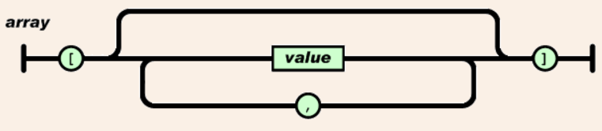
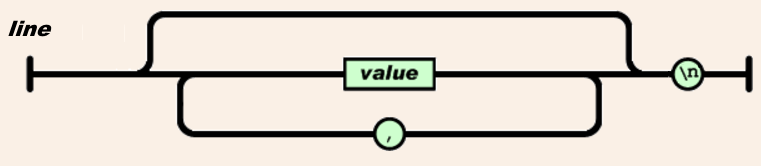

# Introducing CSVJSON

The comma separated values (CSV) format is a simple textual data format that has been used for exchanging tabluar data between programs and systems for many years. There is even an RFC attempting to standardize this format - RFC 4180. 

Still, the CSV format suffers from major shotcomings which make it hard to use reliably across programs and systems even today. These shotcommings include:

* Character encoding of string values is not specified
* There is no standard way to specify null values
* There are no standard escaping rules, in particular for values containing newlines
* There is no way to have object values, array values

**All of that and more is solved by a trivially specified format CSVJSON**

The CSVJSON format is based on the well-known and highly popular JSON format (see http://json.org). For 'simple' data,  CSVJSON is even compatible with the regular CSV format. 

The definition of the CSVJSON format is trivial. Given the definition of a JSON array:

Each line in a CSVJSON file is defined as follows:

That is, each line in a CSVJSON file is actually just like a JSON array, stripped of the openning left square bracket ([) and with a newline replacing the closing right bracket (]). Newline may only appear after the last value while non-new-line whitespaces around values are ignored. Lines with nothing but whitespaces are ignored.

# Questions and Answers

<dl>
<dt>How is CSVJSON related to JSON Lines (http://jsonlines.org/)</dt>
<dd>The JSON Lines format is a textual format for tabular data where each line is a valid JSON value. The CSVJSON format is a textual format for tabular data where each line has zero or more valid JSON values separated by commas. One can view JSON Lines as a special case of CSVJSON.</dd>

<dt>What is the recommended file type extension for a CSVJSON file?</dt>
<dd>The recommended file format for CSVJSON files is .csvj although one can also use the .csv file extension because a valid CSVJSON file is also a comma-seperated-values file (with JSON rules). </dd>

<dt>Can CSVJSON data contain complex JSON objects?</dt>
<dd>Sure. As long as the included JSON object does not have newlines. Note that when including JSON objects in a CSVJSON line, there is little chance a regular CSV parser would be able to read it.</dd>

<dt>Is there a recommended mime type for CSVJSON?</dt>
<dd>The recommended file format for CSVJSON is text/csvjson. Note that this mime type is not yet formally registered.</dd>
	
<dt>How are newlines defined?</dt>
<dd>Both \n and \r\n can serve as newlines meaning the format should work regardless of whether the file was generated on a Windows or a Linux/Unix based system.</dd>
</dl>
